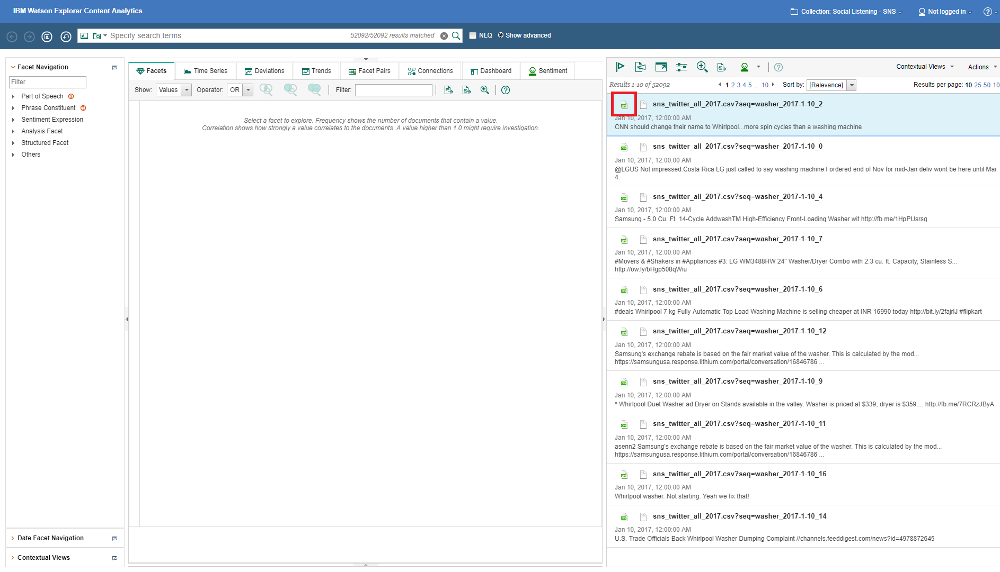
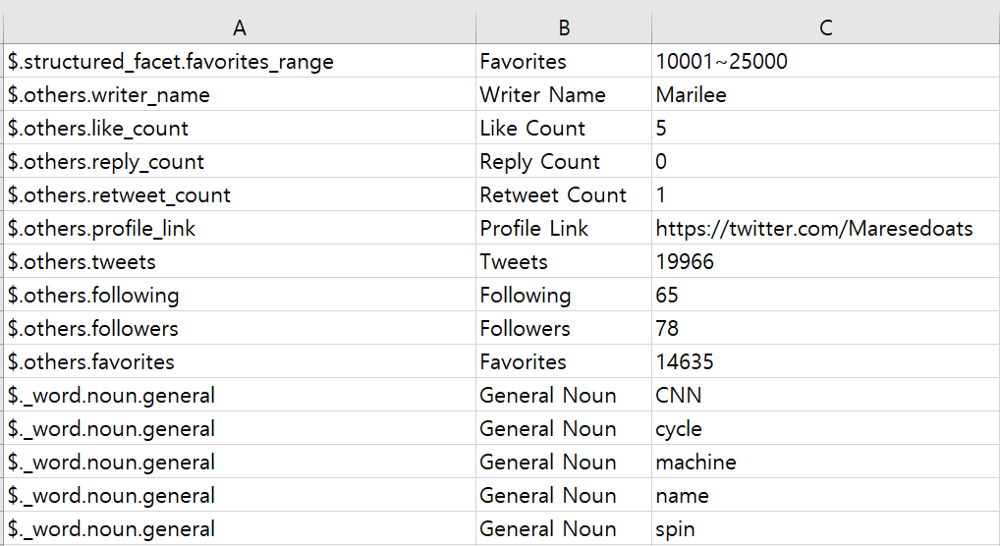

<b>Data Exstracter 
This program extract Facet data on preview screen on WEX minor.
The data contains Analytics Facets, Metadata Facets.
This is necessary to verify the accuracy of the data.
 
# Get into Preview Screen
 
 
# Analytics Facets
 
 
# Metadata Facets
 
 
# Result  
 
